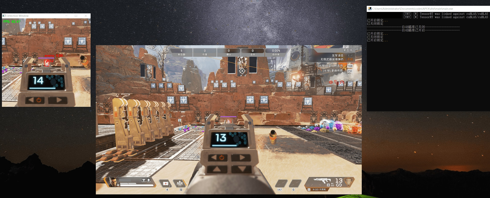
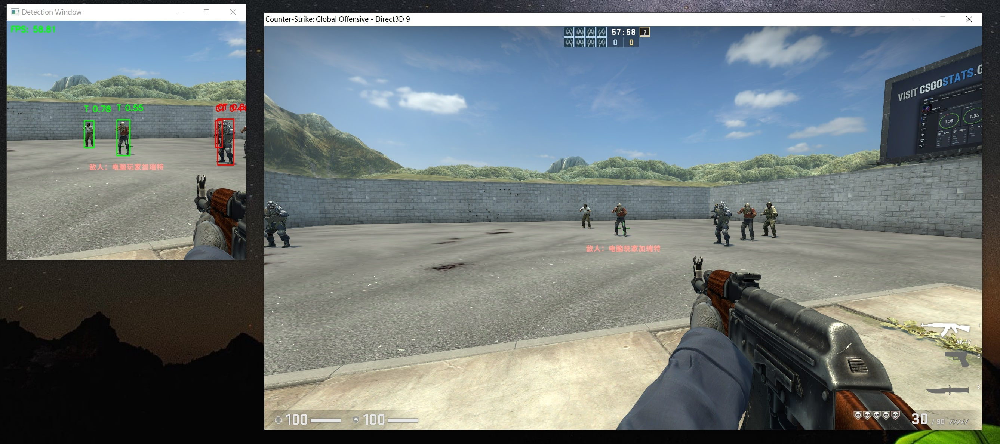

# Introduction
This is a YOLOV7 based APEX and CSGO Aimbot


`Note: This is an educational purposes only software, do not use it for any commercial or illegal purposes, we will not be responsible for any unauthorized usage of this software` 

If you like it, please give me a star, thanks!

#Communication/exchange.
If you are a Chinese user, you can join QQ group 644134220 for timely communication and exchange.
If you have any questions about the project, you can raise them in the issues section.

# Features
- Model can differentiate the enemy and friend
- PID smooth moving
- Individual process to display detection results in real time
- Customize personalized settings through config file
- Tensorrt speed up (solving the shaking problem when speed is fast)
- Encrypt onnx and trt model
- Manage users using `http://www.ruikeyz.com/`
- Save screenshot while locking or detected -> collect new dataset (false positive and negative)
- Annotate images using current models -> faster annotation
- Package to exe

# Environment
My envrionment uses python3.7
```
conda create -n apex python=3.7
conda activate apex
pip install pipwin
pipwin install pycuda
pip install -r requirements.txt
```
Copy `cuda11.3 with tensorrt` to the base directory [download here](https://cowtransfer.com/s/d6f008b24b7d4e)


# Export pt to onnx (This repo provides the onnx model, thus ignore)
`python utils/export_pt_to_onnx.py --weights weights/best.pt --grid --end2end --simplify --topk-all 12 --iou-thres 0.65 --conf-thres 0.35 --img-size 640 640`

# Run 
Running for apex (default hold left button to auto aim):

`python apex.py`

Running for csgo (default hold side button to auto aim and shoot):

`python csgo.py`

You can get the customized settings in `configs/apex.yaml` or `configs/csgo.yaml`, set your suitable `smooth` hyperparameter

# Package
`pyinstaller --key lhaksklasbjhklcvb apex.py`

Copy `mouse_driver/ghub_mouse.dll` &nbsp; `mouse_driver/msdk.dll` &nbsp; `configs` &nbsp; `weights` &nbsp; `cuda_11.3` to the package directory `dist/apex`

Package .exe (apex) can [download here](https://cowtransfer.com/s/d6f008b24b7d4e) (note: due to ruikeyz verification, ip outside china might not work)

# Annotate the dataset using current model
`python utils/anno_imgs.py --data_dir your_dataset_dir --engine_path your_trt_engine_path`
