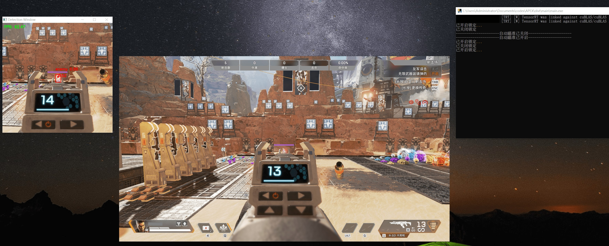
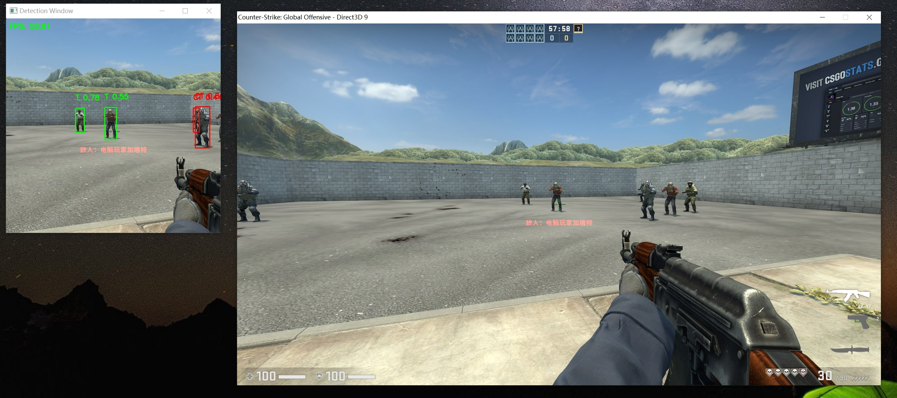

# Introduction
This is a YOLOV7 based APEX and CSGO Aimbot


`Note: This is an educational purposes only software, do not use it for any commercial or illegal purposes, we will not be responsible for any unauthorized usage of this software` 

## If you like it, please give me a star, thanks!
[](https://starchart.cc/NTUYWANG103/APEX_AIMBOT)

# Features
- Model can differentiate the enemy and friend
- PID smooth moving
- Individual process to display detection results in real time
- Customize personalized settings through config file
- Tensorrt speed up (solving the shaking problem when speed is fast)
- Encrypt onnx and trt model
- Manage users using `http://www.ruikeyz.com/`
- Save screenshot while locking or detected -> collect new dataset (false positive and negative)
- Annotate images using current models -> faster annotation
- Package to exe

# Environment
My envrionment uses python3.7
```
conda create -n apex python=3.7
conda activate apex
pip install pipwin
pipwin install pycuda
pip install -r requirements.txt
```
Install cuda11.8 with tensorrt following the [NVIDIA official instructions](https://docs.nvidia.com/deeplearning/tensorrt/install-guide/index.html)

# Export pt to onnx (This repo provides the onnx model, thus ignore)
`python utils/export_pt_to_onnx.py --weights weights/best.pt --grid --end2end --simplify --topk-all 12 --iou-thres 0.65 --conf-thres 0.35 --img-size 640 640`

# Run 
Running for apex (default hold left/right button to auto aim, side button(x2) to auto aim and shoot, side button(x1) to enable and disable the AI:

`python apex.py`

Running for csgo (default hold side button(x2) to auto aim and shoot, side button(x1) to enable and disable the AI):

`python csgo.py`

You can get the customized settings in `configs/apex.yaml` or `configs/csgo.yaml`, set your suitable `smooth` hyperparameter

# Annotate the dataset using current model
`python utils/anno_imgs.py --data_dir your_dataset_dir --engine_path your_trt_engine_path`

# Contact

If you require an executable .exe program, you can obtain the .exe program by joining our QQ group with the ID `644134220`. 


Or you can also join our telegram group.

`https://t.me/+Z7lpWMKfAvc2MDA9`

<a href="https://t.me/+Z7lpWMKfAvc2MDA9" target="_blank"></a>

# Support Author

ETH/USDT (ETH/ERC20): 0x51d9a6F1323ec7ACbd015B02B4EaDa88a90473ef


